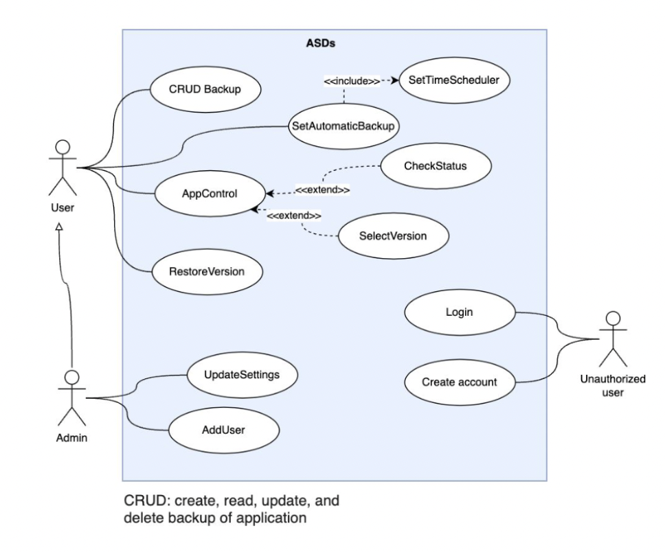

#Main use case diagram

The main use case script displays the main way of interacting with the system. There are 3 actors in the diagram:
* Unauthorized user - future user
* User - the main actor that interacts with the system
* Administrator - the actor who configures the system and adds users.

Most of the interactions with the system are performed by the authorized user. He has the following possibilities:
*  CRUD Backup: creating/reading/updating/deleting backups of applications within the system
*  SetAuthomaticBackup:  managing settings for automatic backup of applications. An obligatory part of this use case is to specify the frequency of creating backups in automatic mode
*  AppControl: application management which includes adding new applications to the system, managing them, viewing previously created backups of application versions, selecting the desired version and viewing the status of the running version
*  RestoreVersion: restoring and launching previously created application backups
*  UpdateSettings: use case is available only for users with the Admin role. It allows administrators to adjust system settings - to determine the relevant backup policies, to regulate the interaction of the system with Kubernetes, to control stored externally on the S3-compatible object storage
*  AddUser: use case is available only for users with the Admin role. It allows application administrators to create accounts for new users of different roles to access different system functions
*  Login: login and password authorization in the system
*  CreateAccount: сreate a new account in the system to use its functionality

