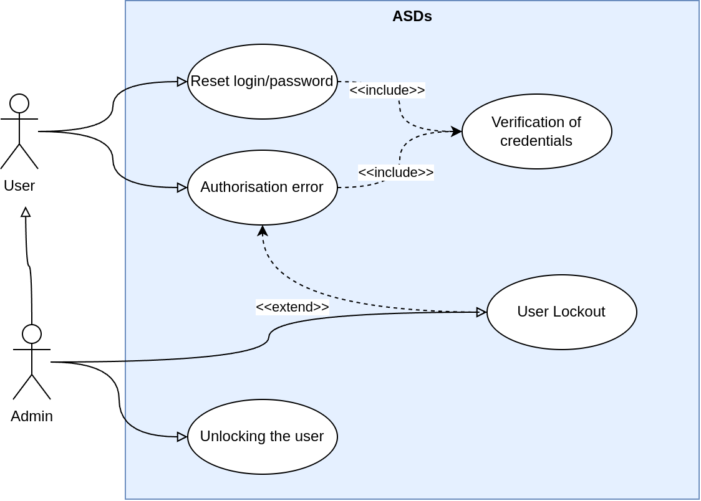
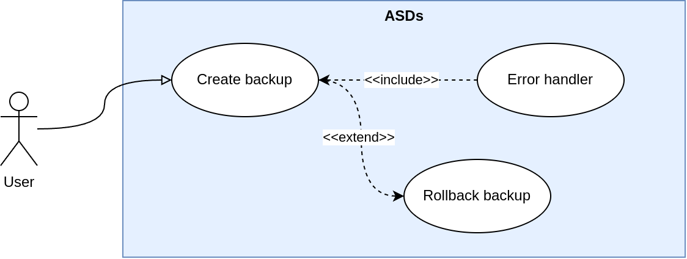
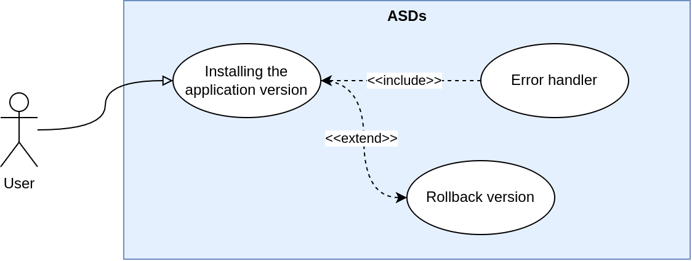

#Alternative use case diagram

Here we present alternative scenarios of system operation under different situations

# First scenario
Use case describes a situation when a user cannot log in to an account. The diagram shows the following scenarios:
* The user recovers the password
* The user receives an authorisation error and his account is blocked.
* Administrator locks the user's account
* Administrator restores the user's account

# Second scenario
Use case describes a situation when an error occurs when creating a backup and we can rollback the backup creation

# Third scenario
Use case describes a situation when an error occurs when installing an application version, as a result of which we can revert to the previous version

