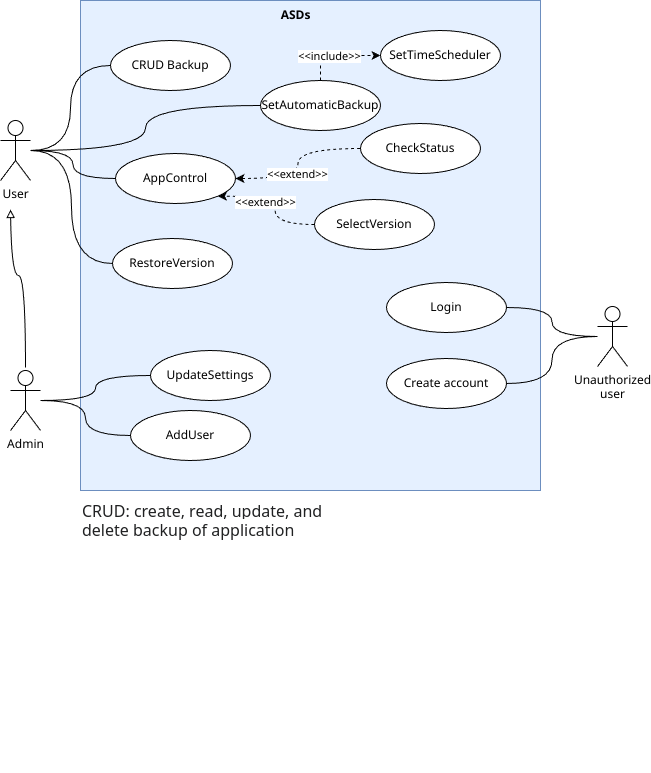

#Main use case diagram

The main use case script displays the main way of interacting with the system. There are 3 actors in the diagram:
* Unauthorized user - future user
* User - the main actor that interacts with the system
* Administrator - the actor who configures the system and adds users.

Most of the interactions with the system are performed by the user. He has the following possibilities:
* Creating/reading/updating/deleting backups
* Start automatic creation of backups
* Application management
* Restore application version

